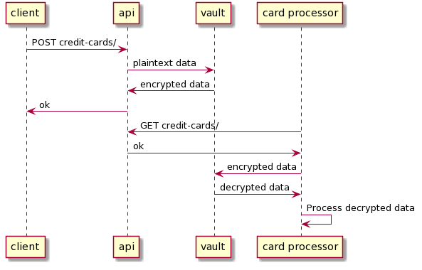

# Encryption as a Service in Action

### TL;DR
Encryption as a Service PoC using Python and Vault.

## Overview


## How to Run
Just do `docker-compose up --build` and you should be ready to go.

## Configuration
Run the following script:
```sh
./bin/vault.sh
```
3 things just happened:

1. The transit Secrets Engine was enabled. This tells vault to **not** save data and turn on the __encryption as a service__ functionality.
2. The root token was created. This one is used by our apps to encrypt and decrypt.
3. A symmetric key was generated. This one is used to encrypt and decrypt the respective data.

Grab the `token` from the output value and put it as `VAULT_TOKEN` env var in:
- `app/settings.py`
- `card_processor.py`

## Using the credit cards application
Send a POST request to `http://localhost:8000/credit-cards/` with the following body:
```
{
    "name":"Carlos Gardel",
    "pan":"4539296620131157"
}
```

If everything went well you should receive the the encrypted Primary Account Number (pan).
```
{
    "name": "Carlos Gardel",
    "pan": "vault:v1:JnC8pS/zmHhHPGd7dk5eCGilnUi8odvRIBP9Z+rBmMLAWXJ/dgYqGAU4MTk="
}
```

If you do a GET request to `http://localhost:8000/credit-cards/` you will still see the encrypted PAN field.


## Using the credit card processor application

Now let's processes the card using the `card_processor.py` service.

```python
python3 card_processor.py
```

We should be able to see that the card was successfully decrypted and processed:
```
Processing CARLOS GARDEL card with number 4539296620131157
```

## Rotating Keys
To minimize the risk if a key is leaked, let's tell Vault to rotate it. 
```sh
./bin/rotate.sh
```

If we do another POST request to the credit card application, we will see that we used `v2` to perform the encryption. 
```
{
    "name": "Aníbal Troilo",
    "pan": "vault:v2:vdIlXggLzrM4n5Xlzxh6a/xpmd7yz/F9MsoifuR/kmOodGKV5wPaWvMMiEw="
}
```

Let's do a GET and see our different encryption key version (v1 and v2):
```
[
    {
        "name": "Carlos Gardel",
        "pan": "vault:v1:JnC8pS/zmHhHPGd7dk5eCGilnUi8odvRIBP9Z+rBmMLAWXJ/dgYqGAU4MTk="
    },
    {
        "name": "Aníbal Troilo",
        "pan": "vault:v2:vdIlXggLzrM4n5Xlzxh6a/xpmd7yz/F9MsoifuR/kmOodGKV5wPaWvMMiEw="
    }
]
```

Let's go back to the `card_processor.py` service. Now we are able to decrypt and process both entries. One was decrypted with `v1` and the other one with `v2`.
```
Processing CARLOS GARDEL card with number 4539296620131157
Processing ANÍBAL TROILO card with number 2720997130887021
```


Voilà. Encryption keys and rotation were handled by Vault.